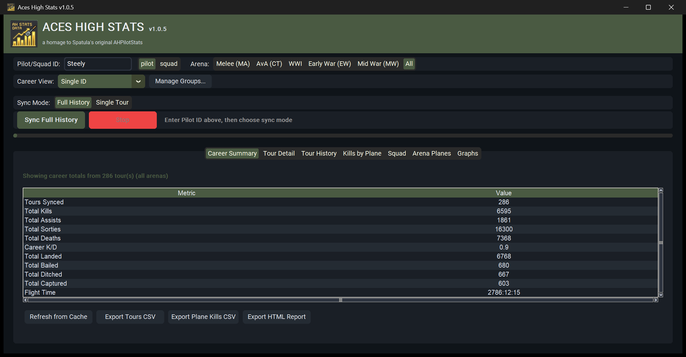
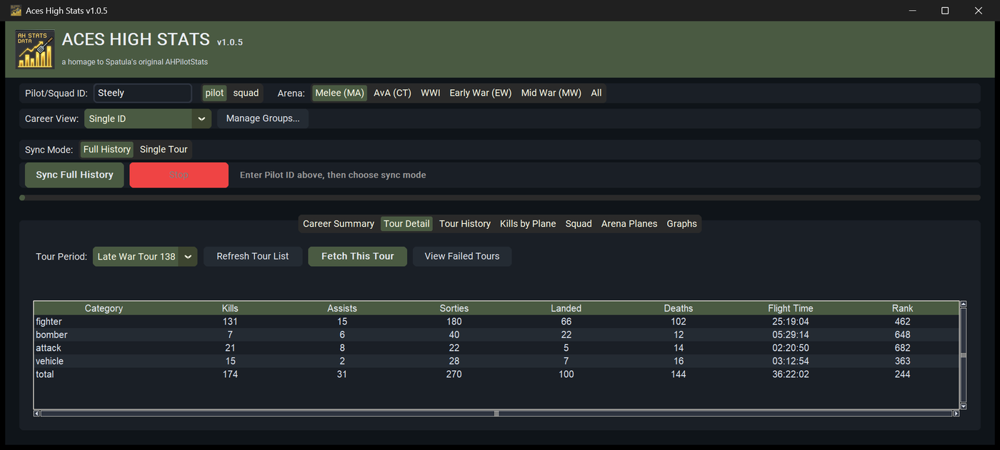
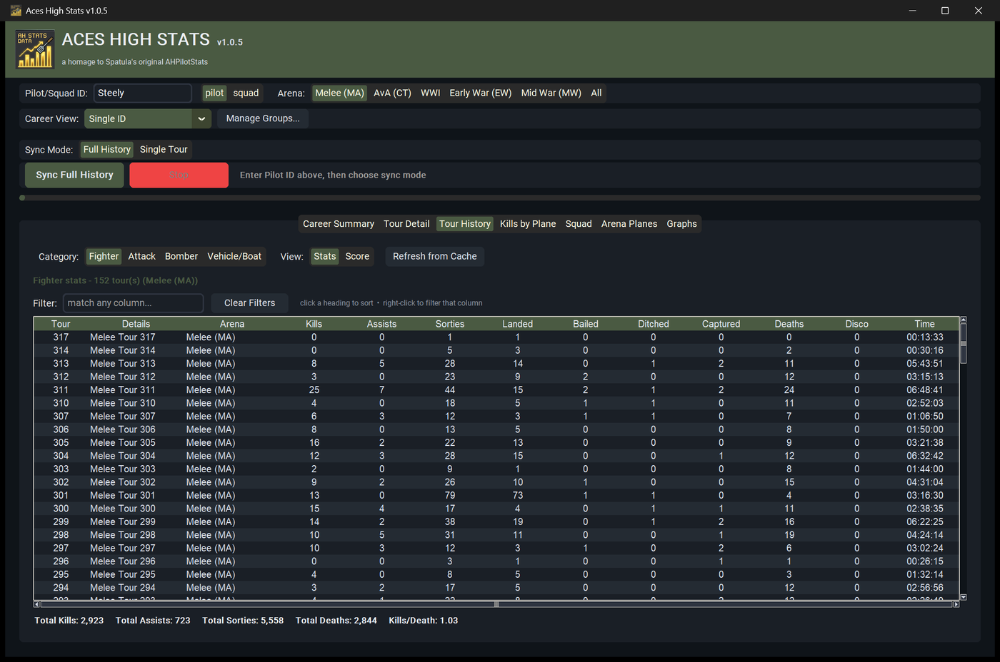
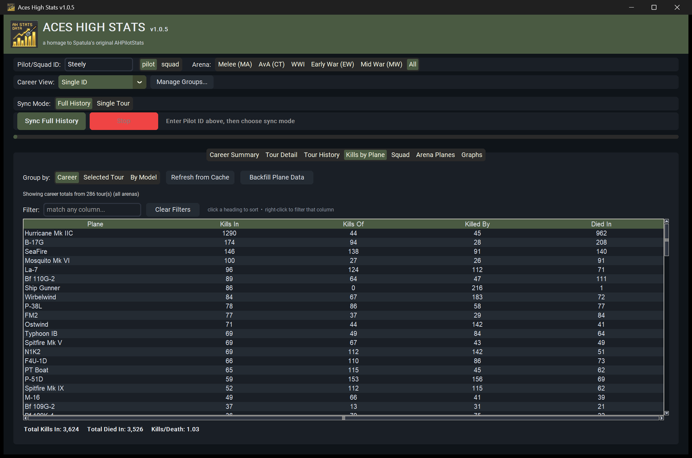
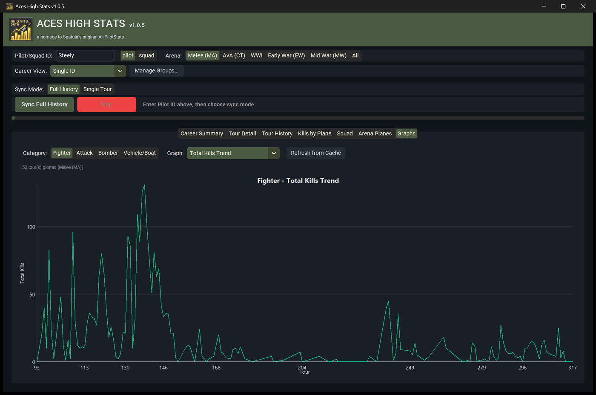
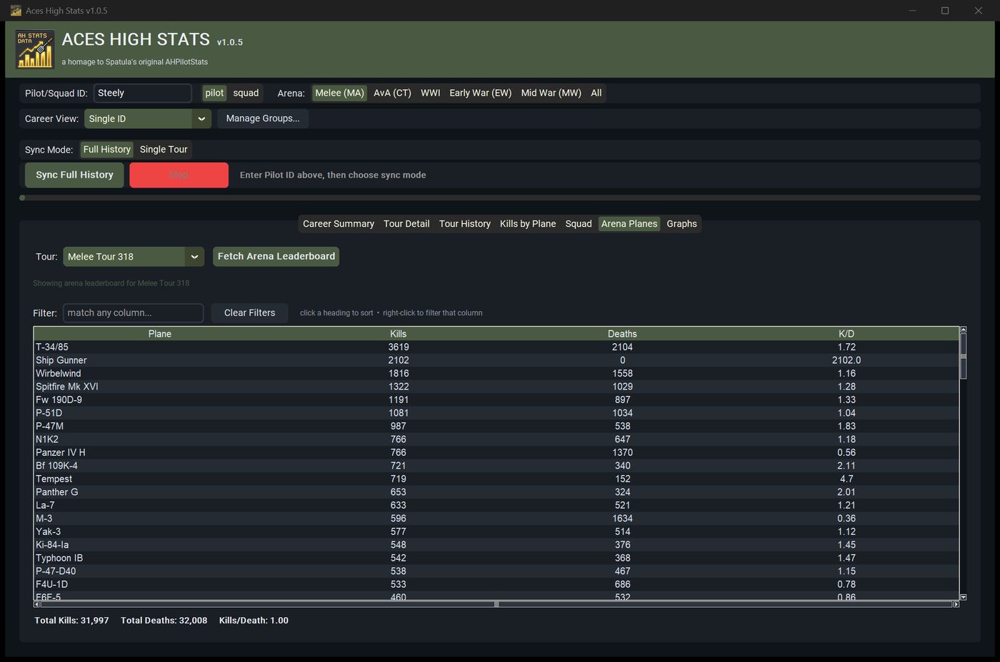
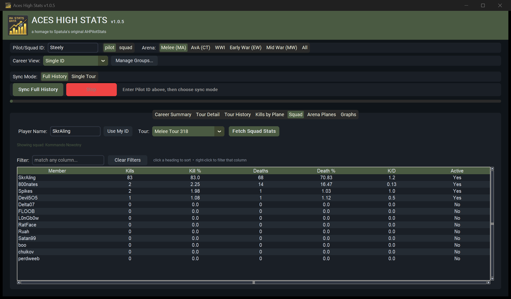

# AHSTATS - Aces High Statistics Viewer

A modern Python desktop application for viewing and analyzing [Aces High](https://www.hitechcreations.com/) MMOG pilot and squad statistics. AHSTATS scrapes and caches data from HiTech Creations' public stats pages into a SQLite database and presents it via a customtkinter GUI with interactive charts.



It's a companion to [FSOStats](https://github.com/steelington/FSOStats), which
does the same for Friday Squad Operations, and shares its palette and grid
components.

## 📸 The tour

**Career Summary** - lifetime totals across every tour and every arena, or
filtered to one arena at a time.

**Tour Detail** - one tour, broken out by category, with the rank you finished
at in each.



**Tour History** - every tour you've flown in one grid, per category, in Stats
or Score view, with running totals that follow the filters.



**Kills by Plane** - the full matrix: what you killed in each type, what you
killed of it, what it killed you with, and what you died in. Career-wide, one
tour, or grouped by model.



**Graphs** - seventeen trends over your whole career, per category - kills,
K/D, sorties, hit percentage and the rest.



**Arena Planes** - the arena-wide aircraft leaderboard for any tour.



**Squad** - any squad's roster for any tour, with each member's kills, deaths
and K/D.



Every grid sorts, filters and exports to CSV: left-click a heading to sort,
right-click it to filter that column.

## ✨ Features

### 📊 **Comprehensive Statistics**
- **Career Summary** - Lifetime totals across all tours
- **Tour Breakdowns** - Per-tour analysis by category (fighter, bomber, attack, vehicle)
- **Aircraft Analytics** - Detailed kills-by-plane matrix (kills in, kills of, killed by, died in)
- **Squad Rosters** - View squad member stats for any tour
- **Arena Leaderboards** - Arena-wide aircraft performance rankings

### 📈 **Interactive Visualizations**
- **Kill Progression Charts** - Line charts showing performance trends over time
- **Category Breakdown** - Pie charts of kills by category
- **Self-Contained HTML Exports** - Beautiful reports with embedded Chart.js visualizations

### 💾 **Smart Caching & Sync**
- **Intelligent Fetching** - Only fetches new tours, re-fetches live tours automatically
- **Progress Persistence** - Resume interrupted syncs from where you left off
- **Error Tracking** - View and retry failed tour fetches
- **Comprehensive Logging** - All operations logged to `ahstats.log`

### 🌐 **Multi-Arena Support**
Supports all Aces High arenas:
- Melee (MA)
- AvA (CT)
- WWI
- Early War
- Mid War

## 🚀 Installation

### Option A: Download the exe (easiest)

Grab the latest `AHStats.exe` from the [Releases](https://github.com/steelington/AHStats/releases) page and run it - no Python required.

> **Antivirus note**: Some antivirus/Windows Defender may flag `AHStats.exe` as a false positive on first run. This is a well-known side effect of how PyInstaller packages Python apps into a single exe (the self-extracting bootloader pattern looks similar to how some malware droppers behave to heuristic scanners) - it's not unique to this app. If it gets flagged or quarantined, restore it from quarantine / add an allow-list entry. The source is right here in this repo if you'd rather verify and build it yourself (see Option B).

### Option B: Run from source

**Requirements:**
- **Python 3.10 or higher**
- Internet connection (for fetching stats from hitechcreations.com)

**Setup:**

1. **Clone the repository:**
   ```bash
   git clone https://github.com/steelington/AHStats.git
   cd AHStats
   ```

2. **Install dependencies:**
   ```bash
   pip install -r requirements.txt
   ```

3. **Run the application:**
   ```bash
   python app.py
   ```

### Building the exe yourself

```bash
pip install pyinstaller
pyinstaller AHStats.spec --clean
```

The exe lands in `dist/AHStats.exe`. It stores its database, cache, and log in `%LOCALAPPDATA%\AHStats\` (running from source instead uses the project folder).

## 📖 Usage

### Syncing Pilot Stats

**Full History** (get everything you've ever flown):

1. Enter your pilot ID in the "Pilot/Squad ID" field
2. Select your arena (or "All" for all arenas)
3. Sync Mode is "Full History" by default - click **"Sync Full History"**
4. Wait for the sync to complete (3+ seconds per tour due to rate limiting)

> **Note**: First sync for a pilot with 100+ tours may take 5-10 minutes due to respectful rate limiting.

**Single Tour** (just want the latest month, or one specific tour):

1. Enter your pilot ID and select your arena as above
2. Switch Sync Mode to **"Single Tour"**
3. Click **"Fetch Tours"** to load the tour list into the dropdown (only needed once - after that the list is cached)
4. Pick a tour from the dropdown and click **"Sync This Tour"**

### Viewing Statistics

- **Career Summary** - Aggregated totals across all synced tours
- **Tour Detail** - Select a tour from dropdown for detailed breakdown
- **Kills by Plane** - Aircraft kill matrix (kills in/of, killed by, died in). Use the **Scope** toggle to switch between **Career** (all synced tours) and **Selected Tour** (follows whichever tour is picked on the Tour Detail tab)
- **Squad** - Look up squad rosters for a specific tour
- **Arena Planes** - View arena-wide aircraft leaderboards

### Exporting Data

- **Export Tours CSV** - Per-tour summary in spreadsheet format
- **Export Plane Kills CSV** - Career kills by aircraft type
- **Export HTML Report** - Interactive HTML with charts (works offline after initial load)

### Resume Interrupted Syncs

If a sync is interrupted (stopped or app closed), AHSTATS will automatically offer to resume on next startup:

1. Restart the application
2. Enter the same pilot ID
3. A prompt will appear asking to resume
4. Click "Yes" to continue from checkpoint

### View Failed Tours

If some tours fail to fetch (network issues, parse errors):

1. Go to **Tour Detail** tab
2. Click **"View Failed Tours"**
3. See list of tours that encountered errors in last 30 days

## 🏗️ Architecture

### Core Modules

- **`gui.py`** (478 lines) - customtkinter-based desktop GUI with 5 tabs
- **`db.py`** (600+ lines) - SQLite persistence with thread-safe access and progress tracking
- **`parser.py`** (502 lines) - BeautifulSoup HTML parsers for HiTech stats pages
- **`client.py`** (178 lines) - Rate-limited HTTP client with SSL cert handling
- **`sync.py`** (180+ lines) - Fetch orchestration with checkpointing and error recovery
- **`export.py`** (250+ lines) - CSV and HTML export with Chart.js integration
- **`theme.py`** (65 lines) - UI theming with military/aviation aesthetic
- **`logger.py`** (30 lines) - Centralized logging configuration

### Data Flow

```
HiTech Website HTML
    ↓ (client.py - rate-limited HTTP with SSL handling)
parser.py (BeautifulSoup extraction to dataclasses)
    ↓ (structured data)
db.py (SQLite persistence with sync tracking)
    ↓ (aggregation queries)
gui.py (customtkinter display with olive theme)
    ↓ (export.py)
CSV / HTML reports with Chart.js visualizations
```

### Database Schema

9 core tables + 3 sync tracking tables:
- **`tours`** - Tour metadata (id, label, dates, arena)
- **`pilot_totals`** - Per-tour aggregated stats by category
- **`pilot_scores`** - Per-tour score breakdowns by metric
- **`pilot_plane_kills`** - Weekly kill breakdown by aircraft
- **`pilot_plane_matrix`** - Career kills in/of/by/died-in per plane
- **`squad_snapshots`**, **`squad_members`** - Squad rosters
- **`plane_leaderboard`** - Arena-wide plane performance
- **`sync_progress`**, **`sync_tour_checkpoints`**, **`sync_errors`** - Progress tracking

### Threading Model

- GUI runs on main thread
- Sync operations run on background thread
- Progress updates via `queue.Queue` polled every 100ms
- Database uses `threading.RLock` for concurrent access safety

## 🎨 Color Theme

AHSTATS features a distinctive military/aviation color scheme:

- **Olive Green** (`#4a5a42`) - Primary buttons and accents
- **Dark Background** (`#0f1419`) - Main background
- **Cream Text** (`#e5e9f0`) - High-contrast readable text
- **Red** (`#ef4444`) - Danger actions (Stop button)

Inspired by WWII-era military aesthetics to complement the game's theme.

## 🛡️ Key Features

### SSL Certificate Handling

HiTech's server doesn't send intermediate certificates during TLS handshake. AHSTATS handles this by:

1. Fetching Sectigo intermediate cert from CDN
2. Converting DER to PEM format
3. Appending to certifi bundle
4. Caching to `ahstats/_cache/ca_bundle.pem`

See `client.py:_ensure_ca_bundle()` for implementation.

### Rate Limiting

**CRITICAL**: Client enforces 3+ second delay between requests to avoid IP blocking:
- Uses `threading.Lock` + `time.sleep()` in `AhScoreClient._request()`
- Tracks `_last_request_time` to calculate delay
- All HTTP calls go through single shared session

### Parsing Strategy

HiTech's HTML is table-based with no CSS classes/IDs:
- Header matching done by text content (e.g., "Total Kills")
- Numeric values extracted via regex (handles commas, negatives)
- Time strings parsed from "hh:mm:ss" or "N days hh:mm:ss"

## 🧪 Testing

Run the test suite:

```bash
python -m tests
```

Test coverage includes:
- Parser validation with real HTML fixtures
- Edge case handling (invalid HTML, missing data)
- Unicode character support

## 🔧 Development

### Project Structure

```
ahstats/
├── ahstats/           # Main package
│   ├── gui.py         # Desktop GUI
│   ├── db.py          # Database layer
│   ├── parser.py      # HTML parsers
│   ├── client.py      # HTTP client
│   ├── sync.py        # Sync orchestration
│   ├── export.py      # Data export
│   ├── theme.py       # UI theming
│   ├── logger.py      # Logging setup
│   └── assets/        # Icons, themes
├── tests/             # Unit tests
│   ├── test_parser.py
│   └── fixtures/      # Sample HTML
├── legacy_source/     # Original C# app (reference)
├── app.py             # Entry point
├── requirements.txt   # Dependencies
├── CLAUDE.md          # Development guide
└── README.md          # This file
```

### Adding New Features

See [CONTRIBUTING.md](CONTRIBUTING.md) for:
- Development setup
- Code style guidelines
- Pull request process
- Architecture patterns

### Common Patterns

**Adding a new stat field:**
1. Update parser dataclass in `parser.py`
2. Add column to table in `db.py` schema
3. Update insert/query methods in `db.py`
4. Add column to GUI treeview in `gui.py`

**Adding a new endpoint:**
1. Add URL constant to `client.py`
2. Add request method to `AhScoreClient`
3. Create parser function in `parser.py`
4. Add orchestration to `sync.py`
5. Wire up GUI controls in `gui.py`

## 📝 License

[MIT License](LICENSE) - Free and open source

## 🙏 Credits

- **Original AHPilotStats** by Spatula (legacy C# .NET version)
- **Data Source**: [HiTech Creations](https://www.hitechcreations.com/) public stats pages
- **UI Theme**: Inspired by hitechcreations.com WW2 aesthetic
- **Charts**: Powered by [Chart.js](https://www.chartjs.org/)

## 📞 Support

- **Bug Reports**: [Open an issue](https://github.com/steelington/AHStats/issues)
- **Feature Requests**: [Open an issue](https://github.com/steelington/AHStats/issues) with "enhancement" label
- **Questions**: Check [CLAUDE.md](CLAUDE.md) for architecture details

## 🚧 Known Limitations

1. **No API**: All data comes from screen-scraping HTML (no official API available)
2. **Rate Limiting**: 3+ second delay between requests is mandatory (good citizenship)
3. **Live Tours**: Tours in progress are re-fetched each sync (stats change frequently)
4. **Multi-Arena**: Some queries filter by arena, others aggregate across all arenas

## 🗺️ Roadmap

Potential future enhancements:
- [ ] Export to Excel with formatted sheets
- [ ] More chart types (radar charts for multi-category comparison)
- [ ] Comparison mode (compare multiple pilots side-by-side)
- [ ] Tour filtering (date ranges, arena, activity level)
- [ ] Custom metrics (efficiency scores, trend analysis)

Contributions welcome!

---

**Fly safe, shoot straight!** 🛩️
